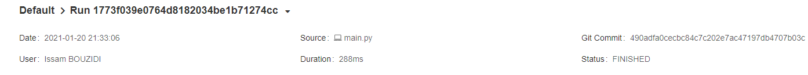
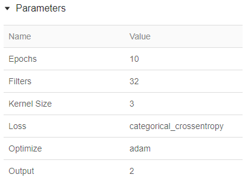
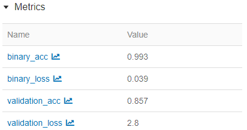
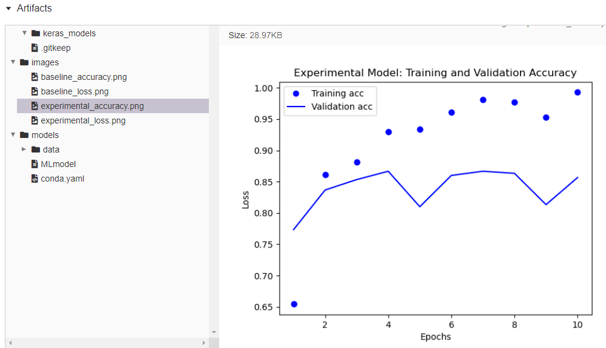

# MLFlow  
  
## introduction  
Utliser MLFlow pour le monitoring des resultats du modèle CNN de classification des images  
  
## Requirements  
Installer requirements.txt pour faire executer ce cide  
  
## Execution  
Il faut lancer le fichier main.py qui va entrainer le modèle CNN et faire le traçage de l'entrainement du modèle  
l'éxecution du fichier se fait par ligne de commande  

## Résultat  
Une fois le mlflow excecuté, lancer le daschbord mlflow sur localhost:5000 pour visualier les resultat du traçage.  
  
### Captures écran résultat  
#### Informations générales  
  

#### Parameters  
  

#### Metrics  
  

#### Exemple graph  
  
